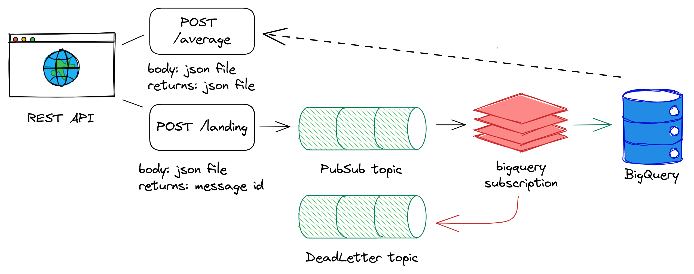

# Trip analysis

This main goal of this project is to develop a REST API to receive data and ingest it into a SQL database.
To achive that, the implemented architecture uses of Google Cloud Platform services. Cloud Functions its used to implement a interface between user and the ingestion topic at Cloud PubSub. The topic at Cloud PubSub has a subscription pushing every message to BigQuery. So, a materialized view reads the landing table and apply some castings to a refined version of the data. There is also a Cloud Function responsible for query the weekly average number of trips for an area, by specifying a bounding box or a region.



## First steps

Create your project at GCP and select a billing account for it. Then, run a `make init` to enable the API services, create a bucket to store terraform state and create the zip files to the cloud functions code. You must change the project id variable at Makefile to your choice and replace the same at the variables file `./gcp/variables.tf` at the terraform project. Finally, we can run the terraform modules:

```bash
make init

terraform init
terraform apply
```

Now you can run `make push` to send messages to the REST endpoint and check if everything is running well.

```bash
make push
```

To test the query endpoint, you can run the following:

```bash
make query
```

The query endpoint is located at https://[your-project].cloudfunctions.net/average, the parameters can be specified as the following:

```json
{
    "type": "bounding_box",
    "upper_left": "0 0",
    "upper_right": "0 90",
    "lower_left": "90 90",
    "lower_right": "90 0"
}
```

```json
{
    "type": "region",
    "region": "Prague"
}
```